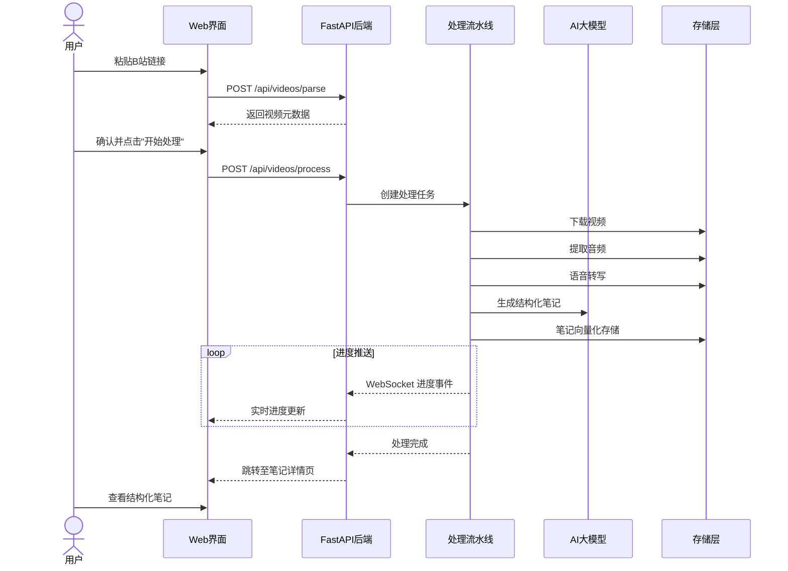
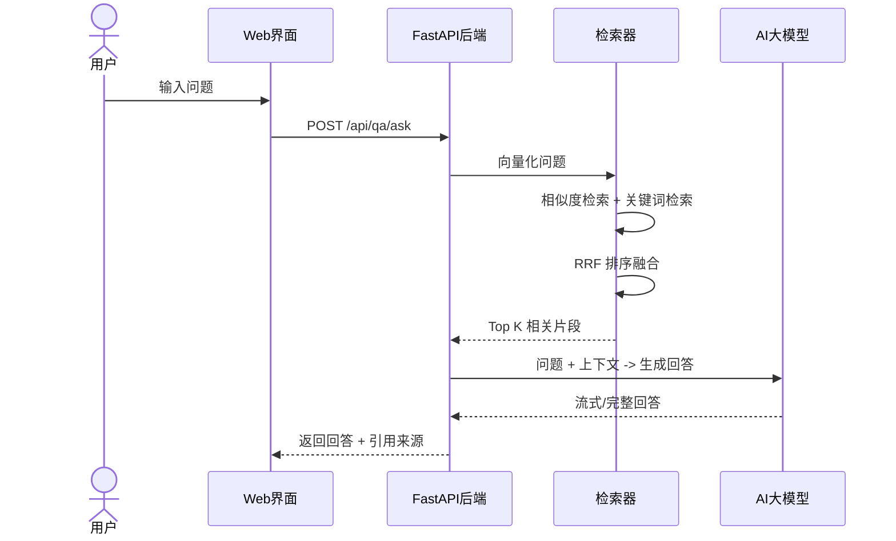

# 产品需求文档 (PRD)

## 视频知识沉淀与智能问答系统

| 文档版本 | 日期 | 作者 | 变更说明 |
|---------|------|------|---------|
| v1.0 | 2026-06-30 | Codex | 初稿完成 |

---

## 1. 产品背景与目标

### 1.1 背景

B 站等视频平台承载了大量高质量知识内容，但视频形式存在以下痛点：
- **信息检索困难**：看过的视频难以快速定位关键内容，回看效率低
- **笔记整理繁琐**：边看边记打断观看体验，笔记不易整理和复用
- **知识断裂**：不同视频间的知识关联无法自动建立，知识体系碎片化
- **时间消耗大**：一个 30 分钟的视频，核心信息可能只有 5 分钟，但需要全程观看

### 1.2 产品目标

构建一套"视频链接 → 自动处理 → 结构化笔记 → 智能问答"的全自动化闭环系统，帮助用户：
1. 一键将视频转化为高质量结构化笔记
2. 对单视频内容进行精准问答
3. 跨视频检索知识库，实现知识关联与综合问答
4. 长期沉淀个人知识库，实现知识的可检索、可复用、可关联

### 1.3 成功标准

- 用户输入 B 站链接后，全自动完成下载→音频提取→转写→笔记生成
- 单视频问答准确率 ≥ 85%（基于结构化笔记内容）
- 跨视频检索能够正确关联相关内容并给出有依据的回答
- 端到端处理一个 30 分钟视频的总耗时 ≤ 15 分钟（含下载、转写、生成）
- 系统可离线运行（依赖本地 Whisper 模型）

---

## 2. 产品范围

### 2.1 核心功能（MVP）

| 功能模块 | 优先级 | 说明 |
|---------|--------|------|
| 视频链接解析与下载 | P0 | 支持 B 站视频/剧集链接解析与下载 |
| 音频提取 | P0 | 从视频文件中提取音频流 |
| 语音转写 | P0 | Faster-Whisper 本地转写 + 必剪 API 作为备选 |
| 结构化笔记生成 | P0 | 调用 LLM 自动生成带章节的 Markdown 笔记 |
| 向量化存储 | P0 | 将笔记切片后向量化存入 ChromaDB |
| 单视频问答 | P0 | 针对单视频笔记内容的问答 |
| 跨视频知识库问答 | P0 | 检索全部知识库后进行问答 |
| 处理进度查看 | P1 | 实时显示下载、转写、笔记生成进度 |

### 2.2 扩展功能（后续版本）

| 功能模块 | 优先级 | 说明 |
|---------|--------|------|
| 多平台支持 | P2 | 支持 YouTube、YouTube 等平台 |
| 笔记手动编辑 | P1 | 在 Web 端编辑/修改生成的笔记 |
| 标签与分类管理 | P2 | 自定义标签对视频进行分类 |
| 知识图谱可视化 | P3 | 可视化展示视频间的知识关联 |
| 批量导入 | P2 | 同时导入多个视频链接 |
| 导出笔记 | P1 | 将笔记导出为 PDF/HTML 格式 |
| 定时更新 | P3 | 自动检测视频更新或新版本 |

---

## 3. 用户画像

### 3.1 主要用户

**个人知识工作者 / 学习者**

| 属性 | 描述 |
|------|------|
| 使用场景 | 日常通过 B 站学习技术、人文、经济等知识内容 |
| 核心需求 | 快速将视频内容转化为可检索、可复用的笔记 |
| 技术能力 | 具备基本计算机操作能力，能使用 Web 应用 |
| 痛点 | 看过的视频内容难以沉淀，知识点分散难关联 |

### 3.2 使用场景

1. **场景 A - 视频学习笔记**：用户看到一个技术讲座视频 → 复制链接到系统 → 系统自动生成结构化笔记 → 用户通过问答深入理解内容
2. **场景 B - 知识复习**：用户想回顾某个知识点 → 在系统中搜索 → 系统返回相关笔记片段 → 用户快速定位到所需信息
3. **场景 C - 跨视频知识关联**：用户问"XXX 的原理是什么" → 系统检索所有相关视频 → 综合多个来源给出回答 → 用户获得完整的知识图谱

---

## 4. 功能性需求

### 4.1 视频链接提交

| 需求 ID | 需求描述 | 优先级 |
|---------|---------|--------|
| FR-001 | 用户可通过输入框提交 B 站视频链接（单视频/剧集） | P0 |
| FR-002 | 系统自动解析链接，提取视频标题、封面、时长、UP 主等信息 | P0 |
| FR-003 | 系统检测链接有效性，无效链接给予明确错误提示 | P0 |
| FR-004 | 支持 B 站短链接格式（b23.tv） | P1 |
| FR-005 | 支持 B 站 BV 号和 AV 号两种格式 | P0 |

### 4.2 视频处理流水线

| 需求 ID | 需求描述 | 优先级 |
|---------|---------|--------|
| FR-010 | 系统自动下载视频资源（支持选择画质） | P0 |
| FR-011 | 从视频文件中提取音频并保存 | P0 |
| FR-012 | 调用 Faster-Whisper 对音频进行语音转写 | P0 |
| FR-013 | 转写结果包含带时间戳的字幕文本 | P0 |
| FR-014 | 支持切换到必剪在线 API 进行转写 | P1 |
| FR-015 | 自动保存转写结果到本地文件 | P0 |
| FR-016 | 处理过程中实时更新任务状态 | P1 |

### 4.3 笔记生成

| 需求 ID | 需求描述 | 优先级 |
|---------|---------|--------|
| FR-020 | 调用 LLM 自动从转写文本生成结构化 Markdown 笔记 | P0 |
| FR-021 | 笔记结构包括：摘要、关键词、章节内容、核心观点总结 | P0 |
| FR-022 | 笔记自动按视频语义章节分段 | P0 |
| FR-023 | 笔记中的关键概念自动生成解释（调用 LLM） | P1 |
| FR-024 | 笔记存储为本地 Markdown 文件，并提供 Web 预览 | P0 |

### 4.4 知识库管理

| 需求 ID | 需求描述 | 优先级 |
|---------|---------|--------|
| FR-030 | 笔记内容自动按标题语义切片（chunk） | P0 |
| FR-031 | 每个切片调用 text-embedding-v3 生成向量并存入 ChromaDB | P0 |
| FR-032 | 支持查看已处理视频列表及状态 | P0 |
| FR-033 | 支持删除视频（同时删除笔记、向量数据等关联数据） | P1 |
| FR-034 | 支持查看单个视频的详细信息（元数据、笔记、转写文本） | P0 |

### 4.5 智能问答

| 需求 ID | 需求描述 | 优先级 |
|---------|---------|--------|
| FR-040 | 支持对单个视频进行问答（检索范围限制在该视频的笔记内） | P0 |
| FR-041 | 支持跨视频知识库问答（检索全部已处理视频） | P0 |
| FR-042 | 问答结果包含引用的笔记片段来源 | P0 |
| FR-043 | 回答展示引用原文，方便用户核查 | P0 |
| FR-044 | 检索采用"向量相似度 + 关键词匹配 + RRF 排序"混合策略 | P0 |
| FR-045 | 支持流式输出（SSE），问答体验流畅 | P1 |
| FR-046 | 对话历史保存在本地 | P2 |

### 4.6 系统管理

| 需求 ID | 需求描述 | 优先级 |
|---------|---------|--------|
| FR-050 | 提供 LLM API 配置界面（通义 / DeepSeek API Key 配置） | P1 |
| FR-051 | 提供转写模型切换（本地 Whisper / 必剪 API） | P1 |
| FR-052 | 查看系统处理统计（视频数、笔记数、磁盘占用等） | P2 |
| FR-053 | 系统日志查看 | P2 |

---

## 5. 非功能性需求

### 5.1 性能

| 需求 ID | 需求描述 | 目标值 |
|---------|---------|--------|
| NFR-001 | 端到端处理 30 分钟视频总耗时 | ≤ 15 分钟 |
| NFR-002 | 问答响应时间（非流式完整响应） | ≤ 5 秒 |
| NFR-003 | 系统启动时间 | ≤ 10 秒 |
| NFR-004 | Web 页面首次加载时间 | ≤ 3 秒 |
| NFR-005 | 视频列表页查询响应 | ≤ 500ms |

### 5.2 可用性

| 需求 ID | 需求描述 | 目标值 |
|---------|---------|--------|
| NFR-010 | 系统支持 7×24 小时连续运行 | 是 |
| NFR-011 | 处理中断后可手动或自动恢复 | 中段任务支持重试 |
| NFR-012 | 系统异常退出不影响已处理数据 | 数据持久化 |

### 5.3 安全性

| 需求 ID | 需求描述 | 优先级 |
|---------|---------|--------|
| NFR-020 | API Key 存储在本地配置文件，不硬编码 | P0 |
| NFR-021 | 本地存储数据不对外暴露 | P0 |
| NFR-022 | 视频文件在处理后可按配置自动删除以节省空间 | P1 |

### 5.4 可维护性

| 需求 ID | 需求描述 | 优先级 |
|---------|---------|--------|
| NFR-030 | 模块化设计，各处理阶段可独立替换 | P0 |
| NFR-031 | 配置文件化管理，支持环境变量覆盖 | P1 |
| NFR-032 | 完整的日志记录，便于排查问题 | P1 |

---

## 6. 用户工作流

### 6.1 核心流程

### 6.2 详细流程

**流程 A：视频处理 (Main Flow)**

**流程 B：智能问答**

---

## 7. 界面概述

### 7.1 页面结构

| 页面 | 说明 |
|------|------|
| 首页 / 工作台 | 链接输入框、最近处理列表、系统概览 |
| 视频列表页 | 已处理视频列表，支持搜索/排序/筛选 |
| 视频详情页 | 视频元数据、笔记预览、问答入口 |
| 问答页面 | 对话框模式，支持单视频 / 全局提问 |
| 设置页 | API Key 配置、模型选择、存储管理 |

### 7.2 交互说明

- 视频处理过程实时更新进度条
- 问答支持 Markdown 渲染（代码块、表格、公式等）
- 引用来源以可点击跳转的方式显示
- 所有操作有明确的加载/空/错误状态

---

## 8. 验收标准

| 编号 | 验收条件 |
|------|---------|
| AC-01 | 输入有效 B 站链接后，系统能正确解析视频元数据 |
| AC-02 | 视频下载完成后，音频文件存在于指定目录 |
| AC-03 | 语音转写完成后，SRT/JSON 格式转写文本存在于指定目录 |
| AC-04 | 笔记生成完成后，Markdown 文件正确渲染 |
| AC-05 | 向量存储完成后，在 ChromaDB 中可查询到对应向量 |
| AC-06 | 单视频问答能基于该视频内容给出正确回答 |
| AC-07 | 跨视频检索能返回来自不同视频的相关内容 |
| AC-08 | 问答回答中包含引用来源标记 |
| AC-09 | 无效链接输入时给出明确错误提示 |
| AC-10 | 处理过程中断网后，系统自动停止并给出提示 |
| AC-11 | 配置页面更改 API Key 后即时生效 |
| AC-12 | 删除视频后，所有关联数据（文件、向量、笔记）全部清除 |

---

## 9. 附录

### 9.1 术语表

| 术语 | 说明 |
|------|------|
| yt-dlp | 开源视频下载工具，支持 B 站 |
| Faster-Whisper | 基于 CTranslate2 的 Whisper 推理加速实现 |
| ChromaDB | 开源嵌入式向量数据库 |
| RRF (Reciprocal Rank Fusion) | 倒数排序融合，用于多路检索结果合并 |
| text-embedding-v3 | 阿里通义的文本嵌入模型 |
| Chunk | 文本切片，将长文本按语义分割为检索单元 |
| RAG | Retrieval-Augmented Generation，检索增强生成 |

### 9.2 参考项目

- [yt-dlp](https://github.com/yt-dlp/yt-dlp)
- [Faster-Whisper](https://github.com/SYSTRAN/faster-whisper)
- [ChromaDB](https://github.com/chroma-core/chroma)

---

*文档结束*
